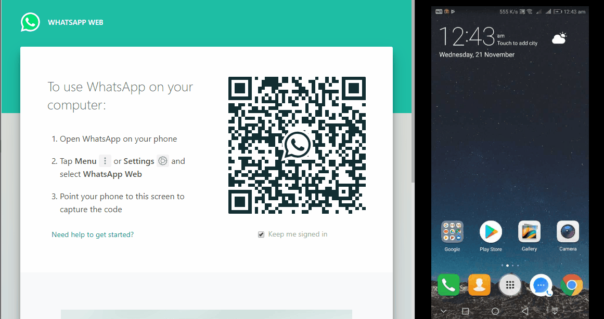

# Whatsbot (web.WhatsApp + Cleverbot.com)

Add cleverbots to your selected whatsapp chats.

A fairly simple JavaScript only code that connects a bot from https://cleverbot.com to a chat in https://web.whatsapp.com.



**Note:** Each bot opens in a new tab. So if you were chatting with 21 people; 21 additional tabs would be open.

## Usage

### Running
1. Install [Tampermonkey](https://chrome.google.com/webstore/detail/tampermonkey/dhdgffkkebhmkfjojejmpbldmpobfkfo?hl=en) extension for Chrome or [Greasemonkey](https://addons.mozilla.org/en-US/firefox/addon/greasemonkey/) for Firefox.
2. In the installed extention, click _Create new Scripts_.
3. Copy contents of each file in `src` folder as a new script and save.

_OR_

3. Dowload this repo.
4. Go to > Utilities > File > Import ( and select `whatsapp.js` and `cleverbot.js` in src folder)

_OR_

3. Dowload [whatsbot.zip](https://github.com/ssp5zone/whatsbot/releases/download/1.0/whatsbot.zip) from latest release.
4. Go to > Utilities > Zip > Import > Select the downloaded file.

_OR_

3. Go to > Utilities > URL > https://raw.githubusercontent.com/ssp5zone/whatsbot/master/src/whatsapp.js 
4. Go to > Utilities > URL > https://raw.githubusercontent.com/ssp5zone/whatsbot/master/src/cleverbot.js

Thats it!! Login to https://web.whatsapp.com and your chats would now be intercepted by the bots. _(Refresh the page if already open.)_

**Note:** To start a new seesion refresh the page. Doing so would create all bots again. However, the old tabs that were opened earlier would still be open!

### Settings
_(Optional)_
You can **Blacklist** or **Whitelist** certain contacts by adding them in `src/whatsapp.js`,
```Javascript
    /**
     * Whitelisted contacts.
     * 
     * I want to attach a bot for these contacts ONLY.
     * Default - Empty => Talk to everyone.
     */
    const whitelist = []; // You can also give a comma seperated values intead of array

    /**
     * Blacklisted contacts.
     * 
     * I DO NOT want any bot talking to these.
     * Default - Empty => Don't ignore anyone.
     */
    const blacklist = []; // You can also give a comma seperated values intead of array
```

## To do
1. Convert `chatListener()` to `MutationObserver` instead of poller.
2. Add source to target bot on init - Only once.
3. Add target load complete watcher.

## Disclaimer
Use wisely.
